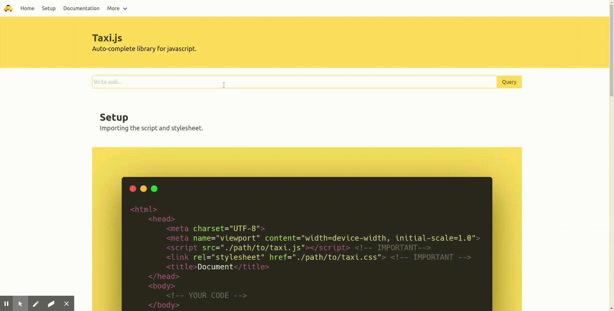

= Taxi.js

image::./logo.png[width=25%]

Extensible and modular auto-complete library for js, for ease of use.
Further modification stated in the link:TODO[todolist].

image:https://img.shields.io/github/contributors/rbrtbrnschn/taxijs?color=yellow&style=for-the-badge[GitHub contributors]

image:https://img.shields.io/github/issues-raw/rbrtbrnschn/taxiJs?color=white&style=for-the-badge[GitHub issues]
image:https://img.shields.io/github/issues-closed-raw/rbrtbrnschn/taxiJs?color=white&style=for-the-badge[GitHub closed issues]

image:https://img.shields.io/github/license/rbrtbrnschn/taxiJs?color=white&style=for-the-badge[GitHub]

image:https://img.shields.io/badge/<Abc>-<Something>-<yellow>.svg[Custom]

= Demo

To visit the demo page, please visit https://taxijs.rbrtbrnschn.dev .

= Setup

== Add scripts to the header
image::./img/code/carbon.png[width=100%]

== Add your input and taxi
image::./img/code/adding_input.png[width=100%]

== Instantiate with custom options
image::./img/code/initialize.png[width=100%]
