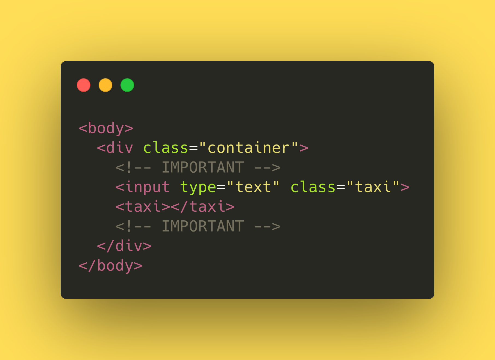
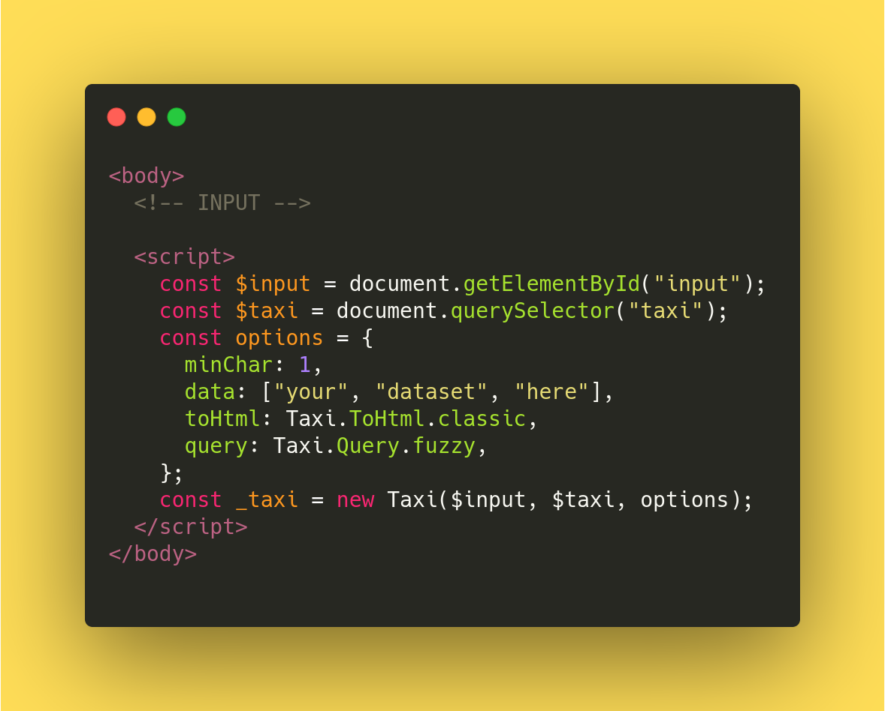

Extensible and modular auto-complete library for js, for ease of use.
Further modification stated in the [todolist](TODO).


To visit the demo page, please visit <https://taxijs.rbrtbrnschn.dev> .

CDN:
====

Via JsDelivr
------------

```html 
<script src="https://cdn.jsdelivr.net/npm/@rbrtbrnschn/taxi.js@1.2.0/dist/web/js/Taxi.js"></script>
<link rel="stylesheet" href="https://cdn.jsdelivr.net/npm/@rbrtbrnschn/taxi.js@1.2.0/dist/css/taxi.css">
```

Via UNPKG
---------

```html 
<script src="https://unpkg.com/@rbrtbrnschn/taxi.js@1.2.0/dist/web/js/Taxi.js"></script>
<link rel="stylesheet" href="https://unpkg.com/@rbrtbrnschn/taxi.js@1.2.0/dist/css/taxi.css">;
```

For plugins
---------
```js
  import Plugin from "https://unpkg.com/@rbrtbrnschn/taxi.js@1.2.0/src/main/js/plugin/Plugin.js";
  import EventPlugin from "https://unpkg.com/@rbrtbrnschn/taxi.js@1.2.0/src/main/js/plugin/EventPlugin.js";
```

Add scripts to the header
=========================


<!-- <iframe
  src="https://carbon.now.sh/embed?bg=rgba%28255%2C221%2C87%2C1%29&t=monokai&wt=none&l=javascript&ds=true&dsyoff=20px&dsblur=68px&wc=true&wa=true&pv=56px&ph=56px&ln=false&fl=1&fm=Hack&fs=14px&lh=133%25&si=false&es=4x&wm=false&code=%253C%21DOCTYPE%2520html%253E%250A%253Chtml%2520lang%253D%2522en%2522%253E%250A%253Chead%253E%250A%2520%2520%253Cmeta%2520charset%253D%2522UTF-8%2522%253E%250A%2520%2520%253Cmeta%2520name%253D%2522viewport%2522%2520content%253D%2522width%253Ddevice-width%252C%2520initial-scale%253D1.0%2522%253E%250A%2520%2520%253C%21--%2520IMPORTANT%2520--%253E%250A%2520%2520%253Cscript%2520src%253D%2522https%253A%252F%252Fcdn.jsdelivr.net%252Fnpm%252F%2540rbrtbrnschn%252Ftaxi.js%25401.1.2%252Fdist%252Fweb%252Fjs%252FTaxi.js%2522%253E%253C%252Fscript%253E%250A%2520%2520%253Clink%2520rel%253D%2522stylesheet%2522%2520href%253D%2522https%253A%252F%252Fcdn.jsdelivr.net%252Fnpm%252F%2540rbrtbrnschn%252Ftaxi.js%25401.1.2%252Fdist%252Fcss%252Ftaxi.css%2522%253E%250A%2520%2520%253C%21--%2520IMPORTANT%2520--%253E%250A%2520%2520%253Ctitle%253EDocument%253C%252Ftitle%253E%250A%253C%252Fhead%253E%250A%253Cbody%253E%250A%2520%2520%253C%21--%2520INPUT%2520--%253E%250A%253C%252Fbody%253E%250A%253C%252Fhtml%253E"
  style="width: 1024px; height: 474px; border:0; transform: scale(1); overflow:hidden;"
  sandbox="allow-scripts allow-same-origin">
</iframe> -->

Add your input and taxi
=======================


<!-- <iframe
  src="https://carbon.now.sh/embed?bg=rgba%28255%2C221%2C87%2C1%29&t=monokai&wt=none&l=javascript&ds=true&dsyoff=20px&dsblur=68px&wc=true&wa=true&pv=56px&ph=56px&ln=false&fl=1&fm=Hack&fs=14px&lh=133%25&si=false&es=4x&wm=false&code=%253Cbody%253E%250A%2520%2520%253Cdiv%2520class%253D%2522container%2522%253E%250A%2520%2520%2520%2520%253C%21--%2520IMPORTANT%2520--%253E%250A%2520%2520%2520%2520%253Cinput%2520type%253D%2522text%2522%2520class%253D%2522taxi%2522%2520id%253D%2522input%2522%253E%250A%2520%2520%2520%2520%253Ctaxi%253E%253C%252Ftaxi%253E%250A%2520%2520%2520%2520%253C%21--%2520IMPORTANT%2520--%253E%250A%2520%2520%253C%252Fdiv%253E%250A%253C%252Fbody%253E"
  style="width: 547px; height: 330px; border:0; transform: scale(1); overflow:hidden;"
  sandbox="allow-scripts allow-same-origin">
</iframe> -->

Instantiate with custom options
===============================


<!-- <iframe
  src="https://carbon.now.sh/embed?bg=rgba%28255%2C221%2C87%2C1%29&t=monokai&wt=none&l=javascript&ds=true&dsyoff=20px&dsblur=68px&wc=true&wa=true&pv=56px&ph=56px&ln=false&fl=1&fm=Hack&fs=14px&lh=133%25&si=false&es=4x&wm=false&code=%253Cbody%253E%250A%2520%2520%253C%21--%2520INPUT%2520--%253E%250A%250A%2520%2520%253Cscript%253E%250A%2520%2520%2520%2520const%2520%2524input%2520%253D%2520document.getElementById%28%2522input%2522%29%253B%250A%2520%2520%2520%2520const%2520%2524taxi%2520%253D%2520document.querySelector%28%2522taxi%2522%29%253B%250A%2520%2520%2520%2520const%2520options%2520%253D%2520%257B%250A%2520%2520%2520%2520%2520%2520minChar%253A%25201%252C%250A%2520%2520%2520%2520%2520%2520data%253A%2520%255B%2522your%2522%252C%2520%2522dataset%2522%252C%2520%2522here%2522%255D%252C%250A%2520%2520%2520%2520%2520%2520toHtml%253A%2520Taxi.ToHtml.classic%252C%250A%2520%2520%2520%2520%2520%2520query%253A%2520Taxi.Query.fuzzy%252C%250A%2520%2520%2520%2520%257D%253B%250A%250A%2520%2520%2520%2520const%2520_taxi%2520%253D%2520new%2520Taxi%28%2524input%252C%2520%2524taxi%252C%2520options%29%253B%250A%2520%2520%253C%252Fscript%253E%250A%253C%252Fbody%253E"
  style="width: 589px; height: 474px; border:0; transform: scale(1); overflow:hidden;"
  sandbox="allow-scripts allow-same-origin">
</iframe> -->