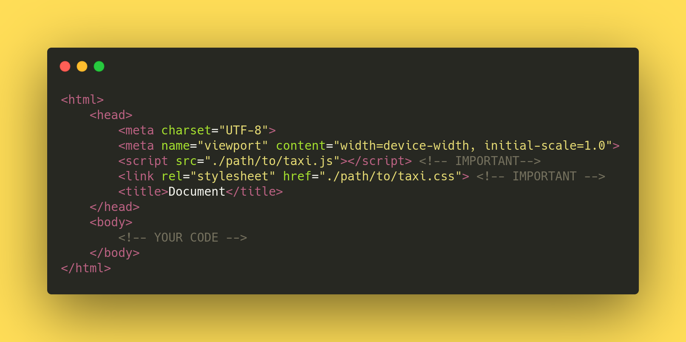

Extensible and modular auto-complete library for js, for ease of use.
Further modification stated in the [todolist](TODO).


To visit the demo page, please visit <https://taxijs.rbrtbrnschn.dev> .

CDN:
====

Via JsDelivr
------------

```html 
<script src="https://cdn.jsdelivr.net/npm/@rbrtbrnschn/taxi.js@1.0.4/js/Taxi.js"></script>
<link rel="stylesheet" href="https://cdn.jsdelivr.net/npm/@rbrtbrnschn/taxi.js@1.0.4/css/taxi.css">
```

Via UNPKG
---------

```html 
<script src="https://unpkg.com/@rbrtbrnschn/taxi.js@1.0.4/js/Taxi.js"></script>
<link rel="stylesheet" href="https://unpkg.com/@rbrtbrnschn/taxi.js@1.0.4/css/taxi.css">;
```

Add scripts to the header
=========================



Add your input and taxi
=======================


Instantiate with custom options
===============================


